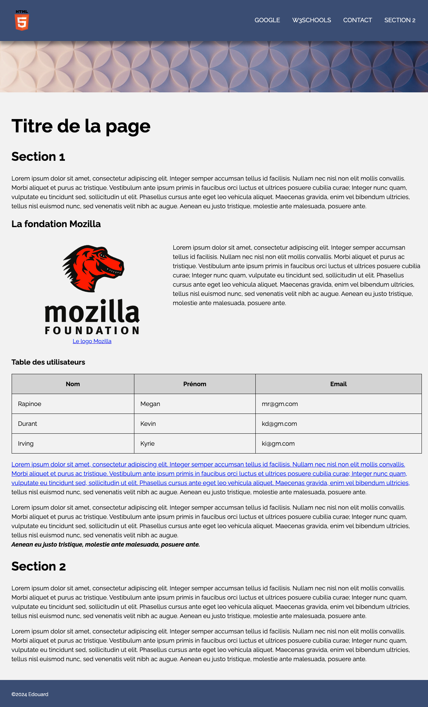

# projet-html-css

Projet de développement web réalisé dans le cadre de ma formation en Bachelor informatique à l'ESGI.

## Objectif

Reproduire une page web à partir d'une maquette visuelle fournie, en se rapprochant le plus fidèlement possible de la mise en page, des couleurs et de la structure présentées sur l'image de référence.

## Maquette de référence

## Technologies utilisées

- HTML5
- CSS3
